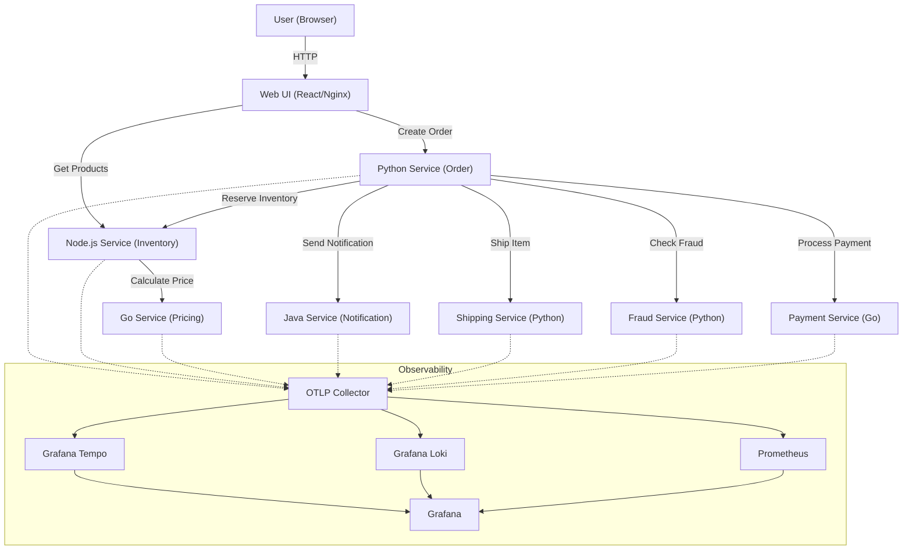

# 🔭 OpenTelemetry Chaos Engineering Demo (Enhanced)

**React Frontend**、**Python (FastAPI)**、**Node.js (Express)**、**Go (Gin)**、**Java (Spring Boot)** で構築された、カオスエンジニアリングとOpenTelemetryのデモンストレーション用マイクロサービスアプリケーションです。

このアプリケーションは、**「自然な」カオス注入**（Natural Chaos Injection）を特徴としており、AIエージェントの根本原因分析（RCA）能力をテストするために設計されています。エラーは明示的な `/error` エンドポイントではなく、特定のリクエストヘッダーやデータパターンに基づいて発生します。

## 🏗️ アーキテクチャ



### サービス一覧

| サービス | 技術スタック | ポート | 役割 |
|---------|------------|--------|------|
| **Web UI** | React (Vite), Nginx | 80 | フロントエンド、注文操作 |
| **Python Service** | Python (FastAPI) | 8000 | 注文管理オーケストレーター |
| **Node.js Service** | Node.js (Express) | 3001 | 在庫管理 |
| **Go Service** | Go (Gin) | 8080 | 価格計算 |
| **Fraud Service** | Python (FastAPI) | 5001 | 不正検知 (Auto-instrumented) |
| **Payment Service** | Go (Gin) | 8082 | 決済処理 |
| **Shipping Service** | Python (FastAPI) | 5000 | 配送シミュレーション |
| **Java Service** | Java (Spring Boot) | 8081 | 通知送信 |

## 🚀 クイックスタート

### 前提条件

- Docker
- Docker Compose

### 実行方法

```bash
# ビルドして起動（初回は時間がかかります）
docker compose up --build -d
```

### 停止方法

```bash
docker compose down
```

## 🎮 カオスシナリオ（Chaos Scenarios）

このデモの核心は、**「自然に見える」障害**を意図的に引き起こすことです。Web UIのCheckout画面から、または特定の入力データを使用することで、以下のシナリオをトリガーできます。

### 1. 高負荷（High Load） - レイテンシー
*   **トリガー**: Checkout画面で `Chaos Scenario: High Load` を選択。
*   **現象**: 注文完了までに通常より長い時間がかかる。
*   **詳細**: 全サービス（Python, Node, Go, Java, Fraud）がランダムなレイテンシー（0.5〜2秒）を追加します。分散トレーシングで遅延の伝播を確認できます。

### 2. レガシー製品の遅延（Legacy Product Slowness）
*   **トリガー**: 商品名に "Legacy" を含む商品（例: **"Legacy Laptop"**）を購入する。
*   **現象**: 在庫チェックが遅くなる。
*   **詳細**: Node.jsサービスが "Legacy" という文字列を検出し、レガシーシステムの応答遅延（2秒）をシミュレートします。

### 3. データベースタイムアウト（Database Timeout）
*   **トリガー**: User ID の末尾が `9` のユーザーを使用する（例: `9`, `19`, `1009`）。
*   **現象**: 注文が失敗し、**504 Gateway Timeout** が発生する。
*   **詳細**: Pythonサービスがデータベース接続のタイムアウト（5秒）をシミュレートします。

### 4. 不正検知（Fraud Detection） - 誤検知
*   **トリガー**: User ID が `4` で始まるユーザーを使用する（例: `404`, `42`）。
*   **現象**: 注文が「不正」として拒否される。
*   **詳細**: Fraud Serviceが特定のユーザーパターンを不正と誤検知するシナリオです。

### 5. 決済失敗（Payment Failure） - 補償トランザクション
*   **トリガー**: カード番号の末尾が `00`（例: `1234567890123400`）。
*   **現象**: 決済が拒否され、注文が失敗する。在庫ロックが解除される。
*   **詳細**: Payment Serviceが決済を拒否し、Python Serviceが**Sagaパターン**に基づいて在庫の解放（補償トランザクション）を行います。

### 6. ブラックフライデー（Black Friday） - ゲートウェイタイムアウト
*   **トリガー**: Checkout画面で `Chaos Scenario: Black Friday` を選択（またはヘッダー `X-Chaos-Scenario: black-friday`）。
*   **現象**: 決済処理がランダムにタイムアウトする。
*   **詳細**: Payment Serviceが高い負荷による外部ゲートウェイのタイムアウトをシミュレートします。

### 7. 配送システム障害（Shipping Failure）
*   **トリガー**: 住所（Address）に "ERROR" という文字列を含める。
*   **現象**: 注文自体は受け付けられるが、配送ステータスがエラーになる。
*   **詳細**: Shippingサービスが配送処理中に内部エラー（500）を発生させます。

### 8. メールプロバイダー障害（Email Provider Outage）
*   **トリガー**: User ID が `666` で始まるユーザーを使用する（例: `666`, `6661`）。
*   **現象**: 通知送信が失敗する。
*   **詳細**: Pythonサービスが `user_666...@fail.com` 宛てのメールを生成し、Javaサービスが外部メールプロバイダーのダウンをシミュレートします。

## 📊 Observability（可観測性）

障害発生時の調査には以下のツールを使用します。

*   **Grafana**: [http://localhost:3000](http://localhost:3000) (ユーザー: `admin`, パスワード: `admin` ※設定により不要な場合あり)
    *   全てのテレメトリー（トレース、メトリクス、ログ）を統合可視化。
*   **Grafana Tempo**: 分散トレーシング。リクエストの全容とボトルネックを可視化。
*   **Grafana Loki**: ログ集約。`trace_id` でログを串刺し検索可能。
*   **Prometheus**: [http://localhost:9090](http://localhost:9090) メトリクス収集。

## 📁 プロジェクト構成

```
.
├── web-ui/                # React Frontend
├── python-service/        # Order Service (FastAPI)
├── nodejs-service/        # Inventory Service (Express)
├── go-service/            # Pricing Service (Gin)
├── fraud-service/         # Fraud Detection Service (Python) [NEW]
├── payment-service/       # Payment Service (Go) [NEW]
├── java-service/          # Notification Service (Spring Boot)
├── shipping-service/      # Shipping Service (FastAPI)
├── docker-compose.yml     # メイン構成ファイル
└── ... (設定ファイル群)
```
